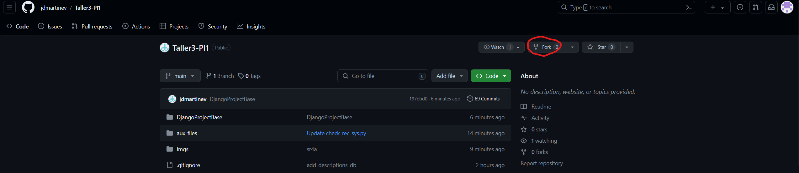
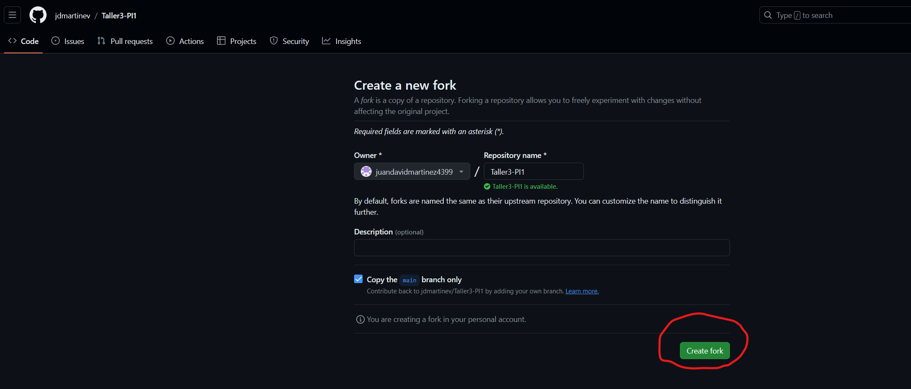
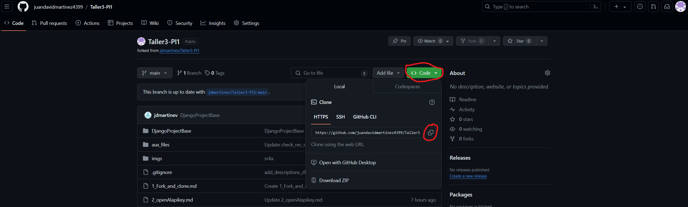

# 🚀 Fork y Clonar el Proyecto

## ¿Qué es un Fork y por qué hacerlo?

Un **fork** es una copia de un repositorio que se crea en tu cuenta de GitHub.  
Permite trabajar en el proyecto de forma independiente sin afectar el repositorio original.  
Este es el primer paso para proponer mejoras o personalizar el proyecto.

---

## 🔨 Pasos para hacer Fork y Clonar el Proyecto

### 1️⃣ Realiza un **Fork** del repositorio base

Ubícate en el repositorio original y selecciona la opción **`Fork`** en la esquina superior derecha.

<div align="center">
  
</div>

### 2️⃣ Crea tu fork personal

Haz clic en el botón **`Create fork`**.

<div align="center">
  
</div>

---

## 📥 Clona el repositorio en tu máquina local

### 3️⃣ Copia la URL del proyecto forkeado
Haz clic en el botón **`< > Code`** y luego selecciona la opción **`Copy`** para copiar la URL del repositorio.

<div align="center">
  
</div>

---

### 4️⃣ Abre la terminal y clona tu fork
Ubícate en la carpeta donde deseas almacenar el proyecto y ejecuta:

```bash
git clone https://github.com/TU_USUARIO/NOMBRE_DEL_REPOSITORIO.git
```

> 🔄 Reemplaza `https://github.com/TU_USUARIO/NOMBRE_DEL_REPOSITORIO.git` con la URL que copiaste.

<div align="center">
  
</div>

✅ Ahora tendrás el proyecto en tu máquina local y listo para trabajar.
