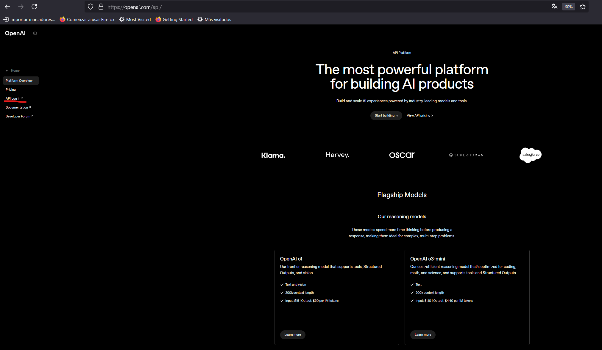
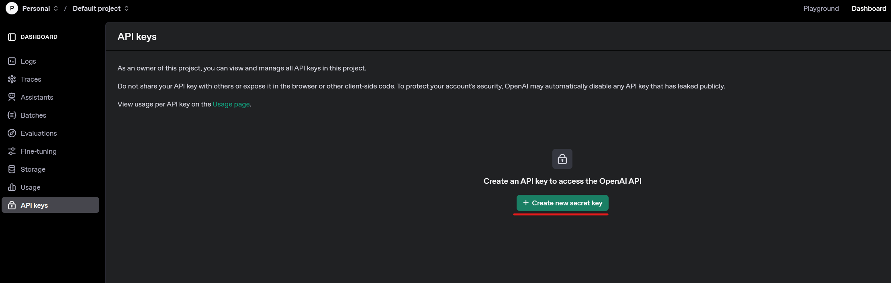
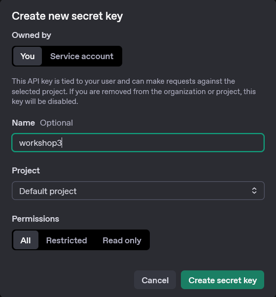
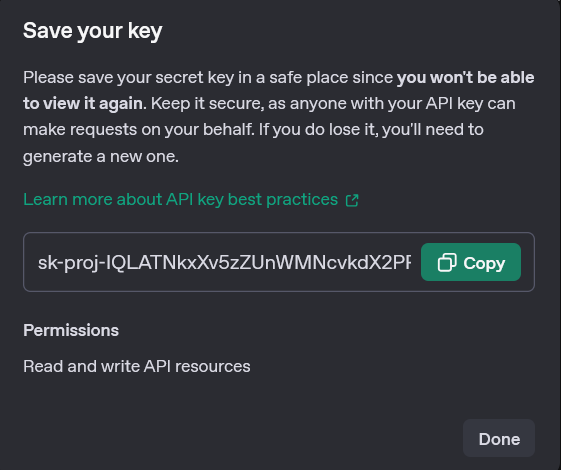
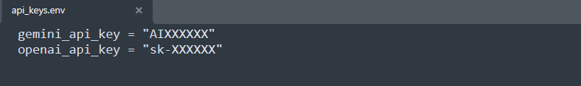
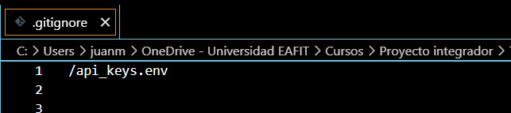

# 🔑 Creación y Protección de la API Key de OpenAI

## 📥 Paso 1: Crear tu API Key en OpenAI

1. Ingresa a la página de OpenAI: [https://openai.com/api/](https://openai.com/api/) e inicia sesión.
   
   <div align="center">
     
   </div>

2. En el panel principal, haz clic en **`Dashboard`**.

   <div align="center">
     
   </div>

3. Haz clic en **`Create new secret key`**.

   <div align="center">
     
   </div>

4. Asigna un nombre a tu API Key, por ejemplo: **`workshop3`**.

   <div align="center">
     
   </div>

5. Copia la API Key generada y haz clic en **`Done`**.

   ⚠️ **Importante:** Después de cerrar esta ventana, no podrás volver a ver esta llave. Guarda la clave en un lugar seguro.

   <div align="center">
     
   </div>

---

## 📥 Paso 2: Almacenar la API Key en un archivo `.env` (Protección de la clave)

Crea un archivo llamado **`api_keys.env`** en la raíz del proyecto usando cualquier editor de texto (VSCode, Sublime, etc.):

```
openai_api_key="sk-XXXXXXXXXXXXXXXXXXXX"
```

<div align="center">
  
</div>

Ubica el archivo **`api_keys.env`** en la carpeta raíz de tu proyecto:

<div align="center">
  
</div>

---

## 🚨 Paso 3: ¡Protege tu API Key con `.gitignore`! 🚨

### 🔒 ¿Por qué es importante?
El archivo `.gitignore` evita que archivos sensibles (como tus llaves de API) se suban al repositorio de GitHub.

- Si tu API key llega a GitHub, puede ser detectada y **bloquearán tu push o podrán usar tu cuenta**.

### ✅ Instrucciones:
1. Verifica que el archivo **`.gitignore`** exista en la raíz de tu proyecto.
   ```bash
   echo. > .gitignore
   ```

2. Abre `.gitignore` y agrega lo siguiente al final:
```
api_keys.env
*.env
.env
```

<div align="center">
  
</div>

✅ Así te aseguras de que la API key **NO SE SUBA** nunca al repositorio.

---

## 📌 Resultado
- Tu API key está guardada de forma segura.
- Puedes cargar la clave desde el archivo `.env` en tu código.
- Git ignorará el archivo y protegerás tus credenciales.

