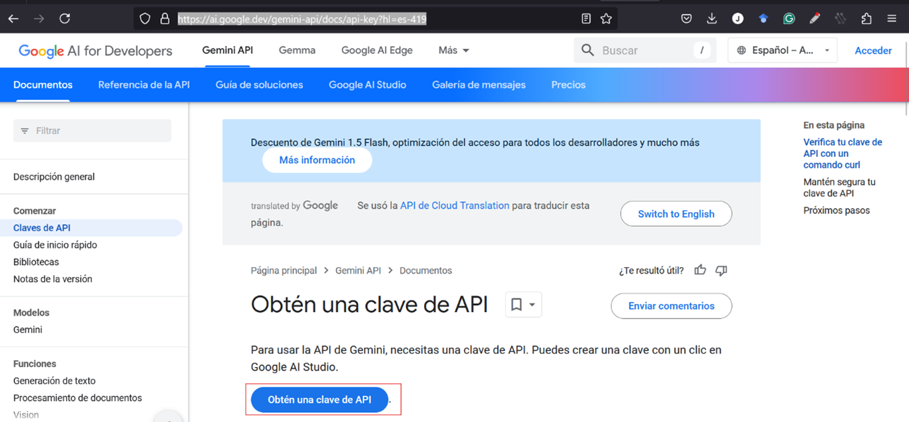
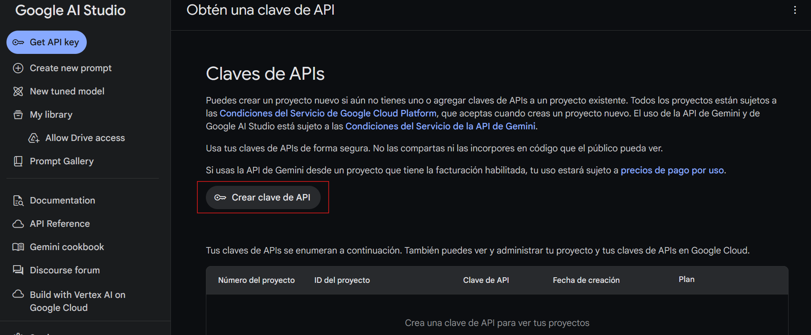
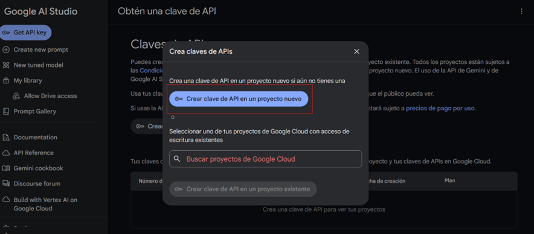
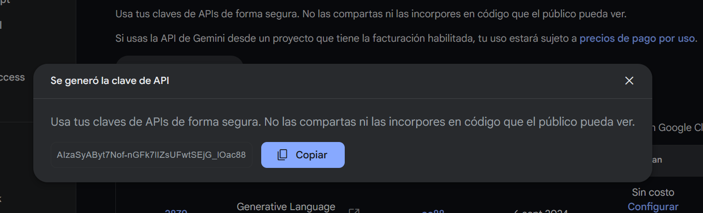
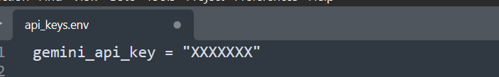
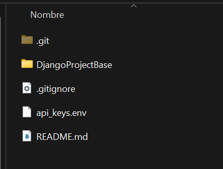
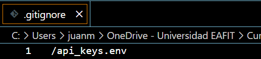

## Creación de la API key de Gemini

**Nota**: La creación de la API key de gemini es opcional, sin embargo puede ser bastante útil para el desarrollo de sus proyectos.

Para crear la API key en openAI, debe ingresar con su cuenta de google a la página de [GoogleAI](https://ai.google.dev/gemini-api/docs/api-key?hl=es-419) e ingresa a ``Obtén una clave de API`` 

 

  
  

  En esta nueva pantalla debe hacer clic en ``Crear clave de API`` 

   

  
  

   

  
  

  Copiar la API y almacenarla en el archivo `api_keys.env`
  
   

  
  

   

  
  

  
Almacene este archivo en la carpeta raíz del proyecto

   

  
  

Verifique que el archivo ``.gitignore`` está en la raíz del proyecto (__si el archivo ya está creado, puede omitir este paso__). Si no está creado, debe ubicarse en la raíz del proyecto y escribir la instrucción ``echo. > .gitignore``

 

  
 

Abra con un editor de texto el archivo ``.gitignore`` que se encuentra en la raíz del proyecto. En este archivo se deben poner los nombres de los archivos que no queremos que se compartan en el repositorio en GitHub

   

  
  

  De esta forma su API key estará segura y no tendrá que compartirla ni escribirla en ningún otro documento.
