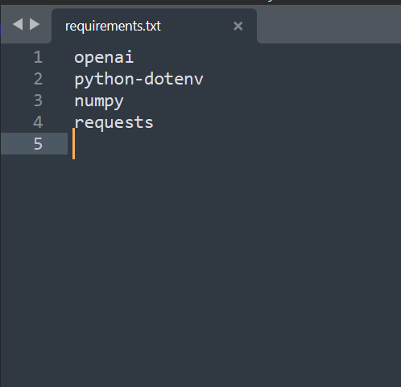

# 📦 Instalación de Paquetes Necesarios

Este workshop es la continuación de los dos anteriores, por lo que se asume que ya tienes instalado:

✅ `Python`  
✅ `Django`  
✅ `Pillow`

---

## 🚀 Nuevas librerías a instalar

En este taller agregaremos las siguientes dependencias:

- `openai`, `google-generativeai`: Librerías oficiales para acceder a modelos de IA
- `huggingface_hub`: Cliente para consumir APIs de modelos de IA de código abierto
- `python-dotenv`: Manejo seguro de las API Keys con archivos `.env`
- `numpy`: Operaciones matemáticas y de álgebra lineal
- `requests`: Consultas directas a APIs como las de OpenAI

---

## 📄 Revisa y edita el archivo `requirements.txt`

El archivo `requirements.txt` lista todas las librerías necesarias para el proyecto.  
Para especificar una versión exacta de alguna librería, usa el formato:

```text
numpy==1.20.1
```

Por ahora, como no requerimos versiones específicas, el archivo puede quedar así:

<div align="center">
  
</div>

---

## 💻 Instalación de las dependencias

Desde la terminal, ubícate en la carpeta donde está el archivo `requirements.txt` y ejecuta:

```bash
pip install -r requirements.txt
```

<div align="center">
  
</div>

✅ Esto instalará todas las librerías necesarias.

---

## 📌 Resultado
Tendrás el entorno listo con todas las dependencias para usar las APIs de OpenAI, Google y Hugging Face de forma segura.

