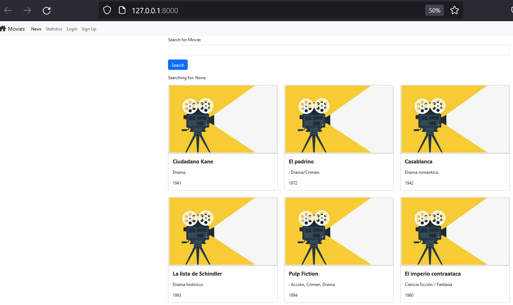
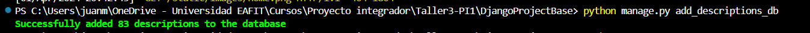
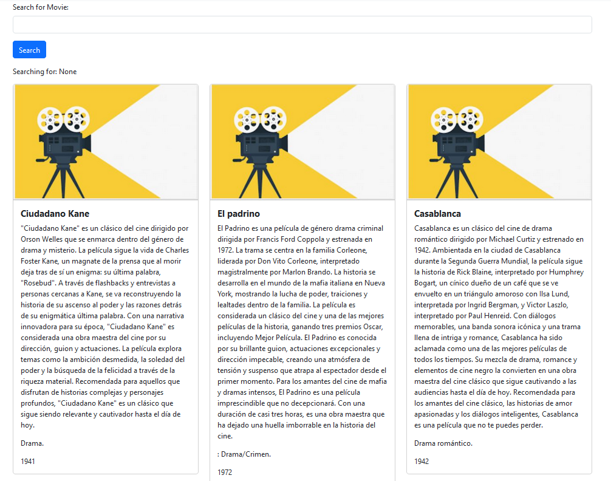
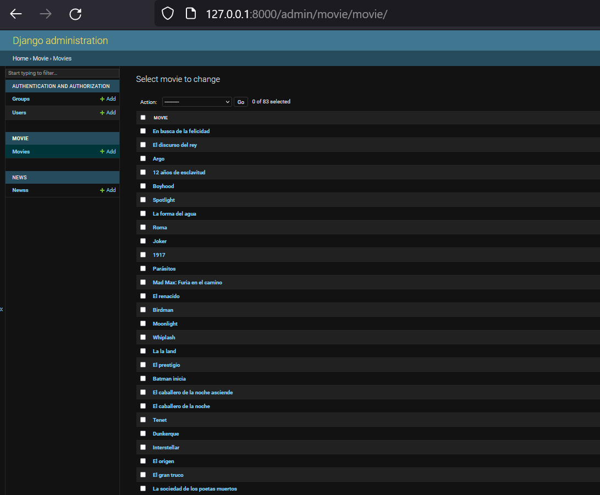

## Descripciones de películas

En esta etapa del proyecto se utilizará la API de OpenAI para generar descripciones de algunas películas que se agregarán a la base de datos.
Para esto, el archivo ``movie_titles.json`` tiene una lista de películas a las que se le agregará información.

El archivo [movie_descriptions.py](movie_descriptions.py) muestra los pasos para utilizar la API de OpenAI para obtener la descripción de las películas que se encuentran en la lista.
En este archivo se pueden ver dos funcionalidades principales:

1. Definición de una función auxiliar (__get_completion__) para comunicarse con la API
2. Creación de un __prompt__ que nos ayuda a pedir de forma correcta la descripción de las películas

Ejecute el script, para esto debe dirigirse en la consola a la ubicación del archivo y escribir:

````bash
python movie_descriptions.py
````

Cuando ejecute el script, deberá ver en la consola algo de la siguiente forma:


Puede ver que se imprime el nombre de la película, el prompt completo y la descripción obtenida.

Al ejecutar todo el script (incluyendo las lineas comentadas) se genera el archivo ``movie_descriptions.json``
que se va a utilizar para alimentar la base de datos de películas. En este caso, por tiempo, no se va a ejecutar el script completo y el archivo resultante se puede consultar en [movie_descriptions.json](movie_descriptions.json).

Ahora se utilizará la información del archivo [movie_descriptions.json](movie_descriptions.json) para agregar items a la base de datos. Para esto nos vamos a dirigir a la carpeta ``DjangoProjectBase``. Asumiendo que la consola está en el directorio raíz del proyecto ``Taller3-PI1``, ejecute lo siguiente:

````shell
cd DjangoProjectBase
````
Si ejecuta el servidor se dará cuenta que este es el proyecto que se creó en el workshop 2 con algunas modificaciones a la lista de películas.

````shell
python manage.py runserver
````


__Nota:__ Antes de continuar es necesario crear un superusuario para acceder al administrador de Django.

````shell
python manage.py createsuperuser
````

Ahora dentro de la carpeta de la app movie debe crear una carpeta management y dentro de esta una carpeta commands. Después, debe crear el archivo add_descriptions_db.py.


Este archivo se utilizará para pasar la información del archivo ``movie_descriptions.json`` a la base de datos de películas de la aplicación de Django. El contenido de este archivo se encuentra en [add_descriptions_db.py](aux_files/add_descriptions_db.py)

Una vez haya terminado estos pasos y copiado el contenido del archivo [add_descriptions_db.py](aux_files/add_descriptions_db.py) en ``movie/management/commands/add_descriptions.py``, en la consola ejecute el siguiente comando:

````shell
python manage.py add_descriptions_db
````
Cuando termine de ejecutarse, debe ver un mensaje como el siguiente:



Puede ejecutar el servidor y verá algo de la siguiente forma:



Además puede ir a la página de administrador 127.0.0.1:8000/admin/ y cuando ingrese con las credenciales podrá observar que las películas quedaron correctamente almacenadas en la base de datos. Además, puede ingresar a alguna de ellas y ver la descripción



__Nota:__ El archivo [movie_descriptions_gemini.py](movie_descriptions_gemini.py) muestra como generar descripciones de las películas utilizando la API de gemini. Este paso es opcional pero puede ser una alternativa libre y sin costo para utilizar en los proyectos.
